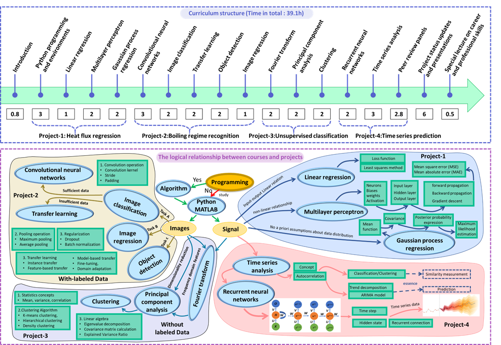

**For U of A students interested in enrolling in the machine learning class in Fall 2025:** If you cannot enroll in the course successfully, please use the following override form: https://uark.sharepoint.com/teams/ENGR/SitePages/Override-Forms.aspx  

# MEEG-44403/54403: Machine Learning for Mechanical Engineers

## Instructors: [Han Hu](https://engineering.uark.edu/directory/index/uid/hanhu/name/Han+Hu/) and [Christy Dunlap](https://cldunlap73.github.io/)
## Organization: [Department of Mechanical Engineering, University of Arkansas](https://mechanical-engineering.uark.edu/)
## Course Description:
### Overview:
This course covers an introduction to supervised and unsupervised learning algorithms for engineering applications, such as visualization-based physical quantity predictions, dynamic signal classification, and prediction, data-driven control of dynamical systems, surrogate modeling, and dimensionality reduction, among others. The lectures cover the fundamental concepts and examples of developing machine learning models using Python and [MATLAB](https://www.mathworks.com/). This course includes four homework assignments to practice the application of different machine learning algorithms in specific mechanical engineering problems and a project assignment that gives the students the flexibility of selecting their topics to study using designated machine learning tools. The overarching goal of this project is to equip mechanical engineers with machine learning skills and deepen the integration of data science into the mechanical engineering curriculum. Compared to machine learning courses offered by computer science and data science programs, this course has a much stronger focus on integration with mechanical engineering problems. Students will be provided with concrete and specific engineering problems with experimental data. The projects, presentations, and in-class peer review practice are designed to foster students’ professional skills following the National Association of Colleges and Employers (NACE) competencies, including critical thinking, communication, teamwork, technology, leadership, and professionalism. Graduate students are required to complete an extra assignment (selected from three provided options) and a supercomputing assignment. 

  

### Learning Objectives:
Students completing this course are expected to be capable of   
•	Develop, train, and test machine learning models using Python/TensorFlow and MATLAB  
•	Develop machine learning models for image classification and clustering  
•	Perform data dimensionality reduction for physics extraction  
•	Analyze images/maps from experiments and simulations to predict physical quantities  
•	Adapt trained machine learning models to new applications  
•	Analyze time series for classification and regression  
•	Develop surrogate models for computationally expensive numerical simulations  
•	Benchmark the scalability of machine learning models on CPU and GPU clusters  
•	Develop complex machine learning models by integrating two or multiple mechanisms in tandem
### Textbook: 
This class does not require a textbook, but the following book is a good reference, particularly for Assignments 1 and 3.  
[Steven L. Brunton, J. Nathan Kutz, Data-Driven Science and Engineering: Machine Learning, Dynamical Systems, and Control, 1st ed, Cambridge University Press, 2019](https://www.databookuw.com/)
### Software Packages:
Python Packages:
* TensorFlow  
* PyTorch  
* NumPy  
* SciPy  
* scikit-learn  
* Keras  
* Pandas  
* Matplotlib  
* Seaborn  
* OpenCV  

MATLAB and Toolboxes:
* [MATLAB](https://www.mathworks.com/products/matlab.html)
* [Deep Learning Toolbox](https://www.mathworks.com/products/deep-learning.html)
* [Statistics and Machine Learning Toolbox](https://www.mathworks.com/products/statistics.html)
* [Image Processing Toolbox](https://www.mathworks.com/products/image-processing.html)
* [System Identification Toolbox](https://www.mathworks.com/products/sysid.html)

## Tutorials for Assignments (MATLAB version):  
### Data source: [Nano Energy and Data-Driven Discovery Laboratory](https://ned3.uark.edu/datasets/)  
### Funding: [MathWorks Curriculum Development Support program](https://www.mathworks.com/company/aboutus/soc_mission/education.html) (Organized by [Mehdi Vahab](https://www.linkedin.com/in/mehdivahab/))
## Acknowledgments:
The most recent content of the course was created by [Christy Dunlap](https://www.linkedin.com/in/christy-dunlap/) under the support of NSF . The initial development of the course was supported by the [Department of Mechanical Engineering at the University of Arkansas](https://mechanical-engineering.uark.edu/)(led by [Steve Tung](https://engineering.uark.edu/mechanical-engineering/faculty/uid/chstung/name/Steve+Tung/)) and the [Arkansas NSF EPSCoR Data Analytics that are Robust and Trusted (DART) Project](https://dartproject.org/) (led by [Jennifer Fowler](https://www.arkansasedc.com/employee-detail/jennifer-fowler)). The experimental datasets used in the assignments were prepared by [Hari Pandey](https://www.linkedin.com/in/haripandey14/) and the development of the original course content was supported by [Connor Heo](https://www.linkedin.com/in/connor-heo-5b790336/) and [Christy Dunlap](https://www.linkedin.com/in/christy-dunlap/). The course syllabi and content were updated following the comments from the Department of Mechanical Engineering Curriculum Committee (chaired by [Steve Tung](https://mechanical-engineering.uark.edu/Directory/index/uid/chstung/name/Steve-Tung/)) and students enrolled in this course from 2021 - 2024. The Python tutorials for the assignments were developed by [Milad Sangsefidi](https://www.linkedin.com/in/milad-sangsefidi/) and [Daniel Peraza](https://www.linkedin.com/in/daniel-peraza-b65b171b9/) (Assignment 1), [Pengxiang Jiang](https://www.linkedin.com/in/pengxiang-jiang-b5b8515a/) (Assignment 2), [Mohammad Kokash](https://www.linkedin.com/in/mohammad-kokash/) (Assignment 3), and [Braden Stevens](https://www.linkedin.com/in/braden-stevens-pe/) (Assignment 4). The MATLAB tutorials for the assignments were developed by [Najee Stubbs](https://www.linkedin.com/in/najeei/) under the support of a gift from the [MathWorks Curriculum Development Support program](https://www.mathworks.com/company/aboutus/soc_mission/education.html) (organized by [Mehdi Vahab](https://www.linkedin.com/in/mehdivahab/)). 
## Publications:
### A. Publications consisting of course projects/assignments
* [J. K. Hoskins, H. Hu, and M. Zou, “Exploring Machine Learning and Machine Vision in Femtosecond Laser Machining,” ASME Open Journal of Engineering, vol. 2, p. 024501, 2023, doi: 10.1115/1.4063646.](https://asmedigitalcollection.asme.org/openengineering/article/doi/10.1115/1.4063646/1169944/Exploring-Machine-Learning-and-Machine-Vision-in)  
* [A.C. Iradukunda, B.M. Nafis, D. Huitink, Y. Chen, H.A. Mantooth, G. Campbell. and D. Underwood, "Toward Direct Cooling In High Voltage Power Electronics: Dielectric Fluid Microchannel Embedded Source Bussing Terminal," IEEE Transactions on Components, Packaging and Manufacturing Technology, 2024](https://ieeexplore.ieee.org/abstract/document/10443930)  
* [C. Dunlap, H. Pandey, and H. Hu, “Supervised and Unsupervised Learning Models for Detection of Critical Heat Flux during Pool Boiling,” in Proceedings of the ASME 2022 Heat Transfer Summer Conference, 2022, pp. HT2022-85582.](https://asmedigitalcollection.asme.org/HT/proceedings/HT2022/85796/V001T08A004/1146566)  
* [L. M. Jr, D. Jensen, and H. Hu, “Supporting Condition-Based Maintenance for Rotary Systems Under Multiple Fault Scenarios,” in Proceedings of the ASME 2023 International Design Engineering Technical Conferences & Computers and Information in Engineering (IDETC/CIE) Conference, 2023, p. V002T02A075.](https://asmedigitalcollection.asme.org/IDETC-CIE/proceedings/IDETC-CIE2023/87295/V002T02A075/1170350?casa_token=-RofT6CbRZsAAAAA:CqTgXasH66LS3JHl5csGpWo0MxPkp4aXxJT5TVoFCNoE1F2e5-9x6aUy3Hx9JbZ5ZZO8n1us)  
* [C. Miller, "Generative Designs of Lightweight Air-Cooled Heat Exchangers," Mechanical Engineering Undergraduate Honors Thesis, University of Arkansas, May 2022](https://scholarworks.uark.edu/meeguht/111/)  
### B. Educational papers
* [H. Hu and C. Heo, “Integration of Data Science Into Thermal-Fluids Engineering Education,” in ASME International Mechanical Engineering Congress and Exposition, Proceedings (IMECE), 2022, vol. 7, no. Dl, pp. 1–10, doi: 10.1115/IMECE2022-88193](https://asmedigitalcollection.asme.org/IMECE/proceedings/IMECE2022/86694/V007T09A023/1157305)  
* [Y. Xu, B. Zhao, S. Tung, and H. Hu, “Infusing Data Science into Mechanical Engineering Curriculum with Course-Specific Machine Learning Modules,” in 2023 ASEE Annual Conference, Jun 2023, Baltimore, MD, 10.18260/1-2--43958.](https://peer.asee.org/infusing-data-science-into-mechanical-engineering-curriculum-with-course-specific-machine-learning-modules)
