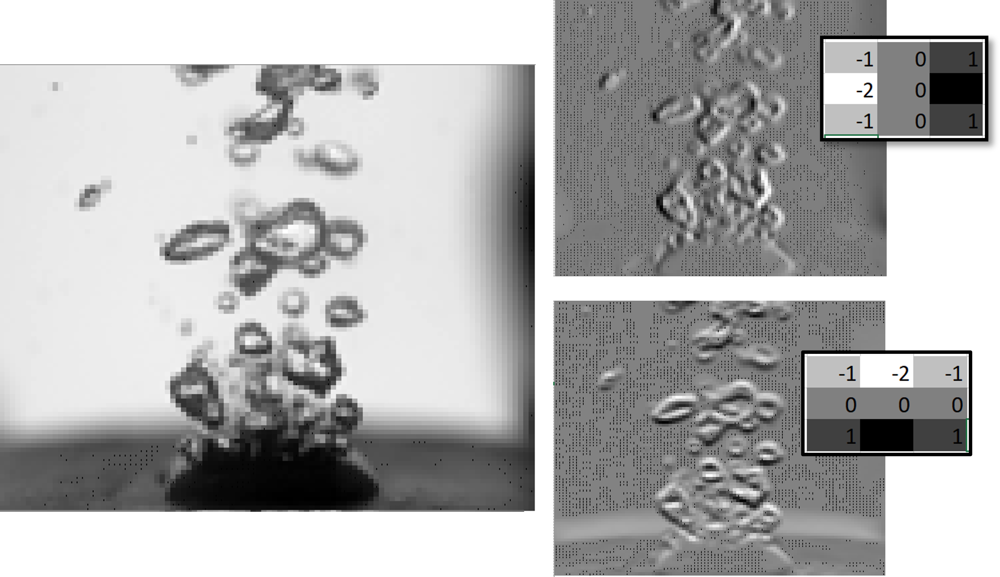
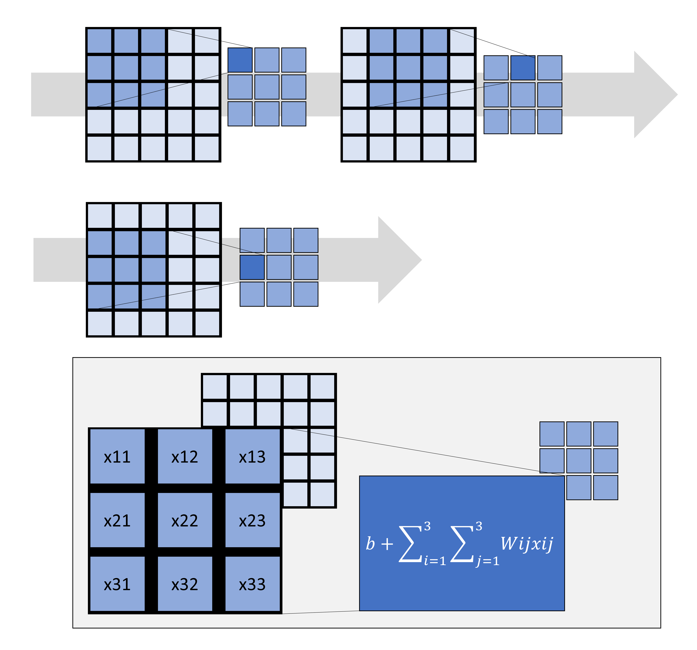

## Topic 2 - Image Classification
Classification has several applications for example automatic sorting. For this assignment, you will create a classification model to sort between nuts and bolts. 

**Tutorial**:<br>
[](https://colab.research.google.com/drive/11Tnvekzz4KN7ytTOJCA9HHvrKh7kVJ03?usp=sharing)

---

#### INTRODUCTION
Classification is a common machine learning task. It is used to predict the category an input belongs to based on its features. There are two types we will focus on; binary classification and multi-class classification. Binary classification describes the instance where there are only two possible categories while for multi-class there are multiple categories. This discussion will assume you have the background knowledge from the previous notes so if you haven't read those at least skim over them. <br><br>


#### CLASSIFICATION MODELS

Let's start with a very simple example dataset to learn the basic concepts of classification. Pretend we want to determine if inputs describe a cat or dog so we have the following dataset:

|weight|ear shape|tail length|animal|
|-----|---|----|---|
|4.0|pointed|25|cat|
|3.5|pointed|22|cat|
|30|floppy|35|dog|
|20|floppy|33|dog|

Once again you would set aside some data for testing your model but we will pretend that has already been done here so this is the training data. Next let's prepare our data. We will want numeric inputs so we need some way of handeling the ear shape and animal variables. We will need to perform categorical encoding. There are two main types; label encoding or one-hot encoding. For label encoding each category is assigned an integer. For one-hot encoding each value is converted to an array with 0's and 1's in columns corresponding to the category. Let's take a look at this visually: <br><br>
For label encoding: let's say pointed=0, floppy = 1 and cat=0, dog=1. So our training data would become:

|weight|ear shape|tail length|animal|
|-----|---|----|---|
|4.0|0|25|0|
|3.5|0|22|0|
|30|1|35|1|
|20|1|33|1|

Label encodings are simple and compact but they can imply an order. <br><br>
For one-hot encoding: let's say pointed is column 1 and floppy is column 2; cat is column 1 and dog is column 2. So our training data would become:

|weight|ear shape|tail length|animal|
|-----|---|----|---|
|4.0|[1,0]|25|[1,0]|
|3.5|[1,0]|22|[1,0]|
|30|[0,1]|35|[0,1]|
|20|[0,1]|33|[0,1]|

One-hot encodings are good because they don't imply an order and are espicially usefule for when an input belongs to multiple classes. However, they will take up more memory than the label encodings. <br><br>

For our case we will use the label encodings since this is just a simple binary classification case (we only have two possible output classes).
So what we will do is set up a neural network. This network will differ from the regression model because of the last layer. For binary classification, we will use one single output neuron with a sigmoid activation function which is defined below and looks like figure 

$$ \sigma (x)= \frac{1}{1+e^{-x}}$$

We will just set up the simplest network with only one layer and neuron which looks like this:

The output will be:

$$ output= \sigma(W_1 \cdot weight + W_2 \cdot earshape + W_3 \cdot taillength +b ) $$

So now due to the sigmoid function the output of our model will be between 0 and 1. So you may be wondering now how does a number between 0 and 1 tell me if it's a dog or cat? Well what you would do to tell what the prediction is choose a cut off (typically .5) and say if it's greater than this then it is classified as a dog and if it is less than this it is a cat. Let's define some random weights and biases and give you some examples of the prediction output. Let's say all the $W_i$'s are 1 and bias is 0. With this random assortment of weights we get the following outputs:

|model output|
|--|
|1|
|1|
|1|
|1|

Now we need to define a loss function. Be very careful here for classification. For this specific structure (binary classification, label encodings, one output neuron, and sigmoid activation function) we will want to use the binary crossentropy loss function:

$$BCE(y,\hat{y})= - [y\cdot log(\hat{y}) +(1-y)\cdot log(1-\hat{y})]$$

Now that we have a loss function this process is exactly the same as the regression neural network. We will just use back propogation to update all the weights iteratively in order to lower the loss. Then, once the model is trained we can perform classification. <br><br>

In python, if we wanted to make a binary classification model for our dataset it would look something like this:

```python
import tensorflow as tf
import numpy as np

# Sample data
X = np.array([
    [4.0, 0, 25],
    [3.5, 0, 22],
    [30.0, 1, 35],
    [20.0, 1, 33]
], dtype=np.float32)

y = np.array([0, 0, 1, 1], dtype=np.float32)

# Define input
inputs = tf.keras.Input(shape=(3,))  # 3 features

# Simple feedforward network
x = tf.keras.layers.Dense(8, activation='relu')(inputs)
x = tf.keras.layers.Dense(4, activation='relu')(x)
outputs = tf.keras.layers.Dense(1, activation='sigmoid')(x)  # binary classification

# Build model
model = tf.keras.Model(inputs=inputs, outputs=outputs)

# Compile
model.compile(optimizer='adam', loss='binary_crossentropy', metrics=['accuracy'])

# Train
model.fit(X, y, epochs=50, verbose=1)
```

Let's talk a bit about multi-class classification. This is where we have more than two classes that the inputs could belong to. For example, predicting between cats, dogs, and foxes. For this instead of having one single output neuron there would be a number of neurons equal to the the number of classes. Additionally, two other things change; loss function and last layer activation function. For the last layer, we will now use a softmax activation function defined as:

$$\hat{y_i} = \frac{e^{Z_i}}{\sum^n_{j=1}e^{Z_j}} $$

This function just makes it so the outputs for one input sum up to one where n is the number of classes and $Z_i$ is the raw score for class i. 

The loss function used depends on the type of encodings you use for the labels. For label encodings you would use sparse categorical loss for one hot encodings you would use categorical cross entropy. Where categorical cross entropy is defined as:

$$ CCE(y,\hat{y}) = - \sum^n_{i=1} y_i log(\hat{y_i})$$

In python, if you wanted to make a multi-class classification model it might look like this:

```python
import numpy as np
import tensorflow as tf
from tensorflow.keras.utils import to_categorical

# Features: [weight, ear shape, tail length]
X = np.array([
    [4.0, 0, 25],
    [3.5, 0, 22],
    [30.0, 1, 35],
    [20.0, 1, 33],
    [2.5, 2, 5],
    [2.0, 2, 6]
], dtype=np.float32)

# Labels (0 = Cat, 1 = Dog, 2 = Fox)
y = np.array([0, 0, 1, 1, 2, 2])
y_cat = to_categorical(y, num_classes=3)

# Build model using functional API
inputs = tf.keras.Input(shape=(3,))
x = tf.keras.layers.Dense(8, activation='relu')(inputs)
x = tf.keras.layers.Dense(4, activation='relu')(x)
outputs = tf.keras.layers.Dense(3, activation='softmax')(x)

model = tf.keras.Model(inputs=inputs, outputs=outputs)

# Compile the model for categorical classification
model.compile(optimizer='adam',
              loss='categorical_crossentropy',
              metrics=['accuracy'])

# Train the model
model.fit(X, y_cat, epochs=100, verbose=1)
```

Now let's talk performance metrics. ROC, Confusion Matrix


#### CONVOLUTIONAL NEURAL NETWORKS
This talk has been about general classification but we will be using images. For images we need ways of extracting features to then predict the class. An image consists of a set of pixel values that describe the color or intensity. For grey scale images each pixel has one value between 0 and 255. For colored images, each pixel has 3 values for the 3 seperate channels (rgb). Our dataset will be grey scale. 

When it comes to neural network image analysis, CNN's are typically to way to go. CNN's are great at extracting features from images that are then used in predictions. To give you a better understanding, we will start with a small discussion using some image processing methods. Kernels (or filters) have been used for several applications in image processing. They are used for blurring/ smoothing images, sharpening images, or highlighting edges in images. Where a kernel is defined as a matrix of size mxn:

$$ K= \begin{bmatrix} 
W_{11} &.. & W_{1n} \\
: & : & : \\
W_{m1} & ..& W_{mn} \end{bmatrix} $$

And a gray scaled image is defined a matrix of size hxw:

$$I = \begin{bmatrix}
p_{11} & p_{12} & .. & p_{1w} \\
p_{21} & p_{22} & .. & p_{2w} \\
: &:&:&: \\
p_{h1} & p_{h2} & .. & p_{hw} \end{bmatrix}$$

Convolution is used to apply the kernel to the image. To do this, first place the kernel over a small portion of the image in this case we will do the top left corner. Then convolution is performed by multiplying each kernel value with the corresponding pixel value. All of these values are then summed to form a new pixel value. Then, the kernel is moved across the image and this process is repeated to generate a new image. The shift of the kernel is defined by a stride. 

$$ (I*K)(x,y)= \sum_{i=1}^m \sum_{j=1}^n I(x+i,y+j) \cdot K(i,j)$$

Okay now that we know how to use a kernel let's show a couple of examples. I want to emphasize the edges of the image so I will use a predefined kernel. There are quite a few but I will use the Sobel kernels. Which are defined as:

$$ \begin{bmatrix}
-1 & 0 & +1 \\
-2 & 0 & +2 \\
-1 & 0 & +1 \\
\end{bmatrix} , \begin{bmatrix}
+1 & +2 & +1 \\
0 & 0 & 0\\
-1 & -2 & -1 \end{bmatrix}$$

Now if we pass these kernels over the image using convolution and fill out the new values we will get the following images. Notice how one emphasizes the edges horizontally and the other emphasizes the edges vertically. A kernel is used to create new versions of the same image that highlight specific features.



What happens if you don't know what kernel to use for highlighting specific features or if you don't know what features are important for your application? This brings us to Convolutional Neural Networks. What we just walked through is the process used in CNN's however, they do not use predefined kernels. Instead kernels of specified sizes are initalized with trainable weights. That way the neural network can determine kernels that will result in the best model performance. For a convolutional layer the number of filters, size of the kernel and stride must be defined.The figure below shows the general process of passing a kernel over an image and outputing a new smaller matrix.<br><br>



So what we can do is pair these convolutional layers with additional layers in a model for class prediction. The weights of these layers are updated with the rest of the layers during training. There are several layers that are commonly paired with convolutional layers included such as: <br><br>

In python, you can use tensorflow to add a convolutional layer for a 200 by 200 gray scale image as:

```python
import tensorflow as tf
from tensorflow.keras import layers, models, Input

inputs=Input(shape=(200,200,1))
x=layers.Conv2D(filters=32, kernel_size(3,3),strides=(1,1), activation='relu')(inputs)
```

**Max pooling**: These layers reduce the size of the image. As you can imagine, image datasets are quiet large so through max pooling layers we can downsample our data. It works by passing over the image and selecting the max value in a specified range of pixels. 

For example, say we have the following matrix that we want to perform max pooling with a size of 2 x 2 and stride of 2 to reduce the size:

$$ \begin{bmatrix}
1 & 2 & 3 & 4 \\
10 & 12 & 8 &1\\
9 & 2 & 6 & 24 \\
6& 0& 4& 3\\
\end{bmatrix}$$

We will first start with the top left corner: 

$$ \begin{bmatrix}
1&2\\
10&12\\
\end{bmatrix}$$

Performing max pooling, we take the highest value which is 12. Then we shift this window by 2 (the stride):

$$ \begin{bmatrix}
3 & 4 \\
8 & 1\\
\end{bmatrix}$$

Then we take the highest value which is 8. Now, we go back to the left side but shift the window down 2.

$$ \begin{bmatrix}
9&2\\
6&0\\
\end{bmatrix}$$

Then, we take 9 from this section. We continue this process until the entire matrix has been covered. Now we construct our new, reduced dimension matrix as:

$$ \begin{bmatrix}
12& 8\\
9&24\\
\end{bmatrix}$$

Let's add one of those layers to our code:

```python
import tensorflow as tf
from tensorflow.keras import layers, models, Input

inputs=Input(shape=(200,200,1))
x=layers.Conv2D(filters=32, kernel_size(3,3),strides=(1,1), activation='relu')(inputs)
x=layers.MaxPooling2D(pool_size(2,2)(x)
```

**Flatten**: A flattening layer is used for reducing the image matrix to an array so it can be passed through the dense layers for prediction. If you have an inputs of (batch size, h, w) it will change it to (batch size, w $\cdot$ h)
For example, say we have batche size of 3 and each is a matrix as follows:

$$ \begin{bmatrix}
1&2\\
3&4 \\
\end{bmatrix}, \begin{bmatrix}
3&5\\
7&9\\
\end{bmatrix}, \begin{bmatrix}
7&0\\
1&3\\
\end{bmatrix}$$

As you can see, the dimension of this data is (batch size, h, w) or (3, 2, 2). If we want to flatten them we will just concatentate the rows of each matrix:

$$\begin{bmatrix}
1&2&3&4\\
\end{bmatrix},\begin{bmatrix}
3&5&7&9\\
\end{bmatrix}, \begin{bmatrix}
7&0&1&3\\
\end{bmatrix}$$

Now the new dimension is (3,4). 

Now lets add a flattening layer:

```python
import tensorflow as tf
from tensorflow.keras import layers, models, Input

inputs=Input(shape=(200,200,1))
x=layers.Conv2D(filters=32, kernel_size(3,3),strides=(1,1), activation='relu')(inputs)
x=layers.MaxPooling2D(pool_size(2,2)(x)
x=layers.Flatten()(x)
```

Now, we have an input similar to our initial discussion so we will just add some dense layers and a single neuron with sigmoid activation function for binary classification:

```python
import tensorflow as tf
from tensorflow.keras import layers, models, Input

inputs=Input(shape=(200,200,1))
x=layers.Conv2D(filters=32, kernel_size(3,3),strides=(1,1), activation='relu')(inputs)
x=layers.MaxPooling2D(pool_size(2,2)(x)
x=layers.Flatten()(x)
x=layers.Dense(64, activation='relu')(x)
outputs=layers.Dense(1, activation='sigmoid)(x)

model=tf.keras.Model(inputs=inputs, outputs=outputs)
```

**Padding**: Another concept used within CNN's is padding. Due to the nature of a CNN with a pass of a filter the dimension of the image will decrease depending on the size of the kernel and stride. In cases where you want to avoid this reduction padding will be added to the exterior of the matrix. For example consider the simple matrix again:

$$ \begin{bmatrix}
1 & 2 & 3 & 4 \\
10 & 12 & 8 &1\\
9 & 2 & 6 & 24 \\
6& 0& 4& 3\\
\end{bmatrix}$$

If we were to perform convolution with a 2 by 2 kernel and stride of 1 we might get something like this (assuming all weights are 1 and biases are 0):

$$ \begin{bmatrix}
25 & 25 & 16 \\
33&28&39 \\
17&12&37\\
\end{bmatrix}$$

You can see how the matrix went from 4 by 4 to a 3 by 3. To avoid this we can implement padding. For this example we will just add zeros around the matrix but keep in mind there are other types of padding:

$$ \begin{bmatrix}
0&0&0&0&0\\
0&1 & 2 & 3 & 4 \\
0&10 & 12 & 8 &1\\
0&9 & 2 & 6 & 24 \\
0&6& 0& 4& 3\\
\end{bmatrix}$$

So now the new output after convolution becomes:

$$ \begin{bmatrix}
1&3&5&7 \\
11&25&25&16\\
19&33&28&39\\
15&17&12&37\\
\end{bmatrix}$$

Which retains the original shape.

To add python to your convolutional layers in python just set the variable "padding" to same:

```python
x=layers.Conv2D(filters=32, kernel_size(3,3),strides=(1,1),padding="same", activation='relu')
```

**Data Augmentation**: Another important concept for image processing using a CNN is data augementation. Data augmentation is always a good idea but especially when you have a small, simple dataset. Data augmentation is where you artificially increase your dataset by generating new data from the previous ones. This can look like random cropping, flipping the image, brightness adjustments, etc. This can improve your models ability to extract relevant features and avoid overfitting. Tensorflow has built in functionalities for handeling augmentation easily. 

