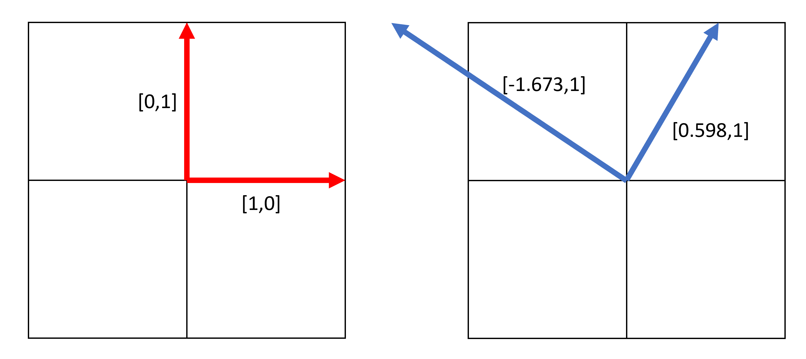
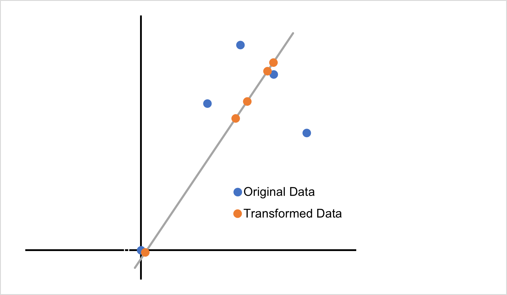
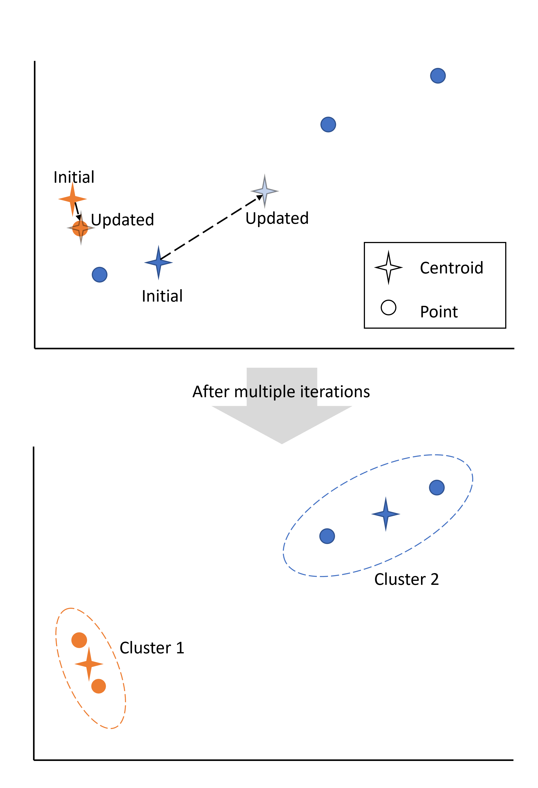

### Topic 3 - Dimensionality Reduction and Clustering
Perform dimensionality reduction and clustering analysis of the same dataset used in HW-2.<br/>
(a) Run single value decomposition (SVD) or principal component analysis (PCA) of the images and plot the percentage explained variance vs. the number of principal components (PC).<br/> (b) Pick a representative image, run PCA and plot the reconstructed images using a different number of PCs (e.g. using PC1, PCs 1-2, PCs, 1-10, PCs 1-20, etc.).<br/> (c) Calculate the error of the reconstructed images relative to the original image and plot the error as a function of the number of PCs.<br/> (d) Run a clustering analysis of the boiling images using the PCs (the number of PCs to use is up to your choice) and evaluate the results of clustering.<br/>

The dataset for this assignment can be accessed at https://data.mendeley.com/datasets/5kjnphrbsz/1


---

#### INTRODUCTION
Unsupervised learning is commonly used for dimensionality reduction and clustering. This is unlike the work we have previously done since it does not use labeled data. Instead is works to find patterns within the data. For this section we will go other some popular unsupervised learning methods that you will implement. 

### SINGLE VALUE DECOMPOSITION (SVD)

### PRINCIPLE COMPONENT ANALYSIS (PCA)
A very common dimensionality reduction algorthim is PCA. It works by defining a new set of basis vectors that capture the most variance. Now that may not make sense yet but please bear with me. As with most things it probably is easist to explain with an example. So let's take a very simple dataset:

|$x_1$|$x_2$|
|--|--|
|0|0|
|2|5|
|3|7|
|4|6|
|5|4|

Okay now pretend this huge dataset is way to large for your computer to handle or maybe you just want to eliminate noise. So you want to reduce the size of it. There are mulitple ways you could reduce the size for example maybe droping one of the $x_i$'s but if you do that you may be losing important information for what ever application you have planned for this data. So you decide PCA might be a great approach. I will walk you through the process then explain what it did to your data.

First you need to normalize the data by subtracting by the mean. In this case the mean is $[2.8,4.4]$.

|$x_1$|$x_2$|
|--|--|
|-2.8|-4.4|
|-0.8|0.6|
|0.2|2.6|
|1.2|1.6|
|2.2|-0.4|

Next you calculate the covariance matrix. This will describe how each variable varies in relation to the others. Since we have a 2D problem we will have a 2x2 matrix as follows:

$$
C = \begin{bmatrix}
\text{cov}(x_1, x_1) & \text{cov}(x_1, x_2) \\
\text{cov}(x_2, x_1) & \text{cov}(x_2, x_2)
\end{bmatrix}
$$

Where: 

$$cov(x_1,x_1)=\frac{1}{n-1}\sum_{i=1}^n(x_{1,i}^2)$$ 

$$cov(x_2,x_2)=\frac{1}{n-1}\sum_{i=1}^n(x_{2,i}^2)$$

$$cov(x_1,x_2)=cov(x_2,x_1)=\frac{1}{n-1}\sum_{i=1}^n(x_{1,i}*x_{2,i})$$

Plugging our values into these equations:

$$
C = \begin{bmatrix}
3.7 & 3.35 \\
3.35 & 7.3
\end{bmatrix}
$$

Now with the covariance matrix, you solve for the eigenvectors ($v$) and values ($\lambda$):

$$Cv=\lambda v$$

This is something you have probably seen before but I will quickly walk you through it:

$$det(C-\lambda I)=0$$

$$ det \left( \begin{bmatrix}
3.7-\lambda & 3.35 \\
3.35 & 7.3- \lambda 
\end{bmatrix} \right)= (3.7-\lambda)*(7.3-\lambda)-(3.35)(3.35)=0$$

Then solving for $\lambda$ gives $\lambda = 1.697, \lambda = 9.303$. You then plug these back into the equation to get the corresponding eigenvectors $v=[-1.673,1] $ and $v=[0.598,1] $, respectively.
These eigen vectors now define our new space. Previously, our space was defined by the vectors [1,0] and [0,1]. Figure NUMBer shows the original basis and the new basis.



You can actually represent every data point as a linear combination of the basis vectors. For example $[x1,x2]=[0.2,2.6]$

$$ \begin{bmatrix} 
0.2 \\ 
2.6 \end{bmatrix} = 0.2 \begin{bmatrix} 
1 \\
0 \end{bmatrix} + 2.6 \begin{bmatrix} 
0 \\
1 
\end{bmatrix} $$

$$ \begin{bmatrix} 
0.2 \\ 
2.6 \end{bmatrix} = 2\begin{bmatrix} 
0.598 \\
1 \end{bmatrix} + 0.597 \begin{bmatrix} 
-1.673\\
1 
\end{bmatrix} $$

Now we sort the eigenvalues from highest to lowest. $9.303 > 1.697$ and use this to sort the corresponding vectors. 
The vectors with the highest corresponding vectors represent the directions with the most variance in the data. In our case the vector $v=[0.598,1]$ represents the most variance. 
So what we can do is choose how many coefficents (or PCs) we want to keep. And then we can convert all of our datapoints into this new space and only keep a specified amount of dimensions. In our simple case we will only keep the first dimension. So to transform our data to our pc we use some matrix multiplication.<br><br>
We define A (the matrix of eigenvectors):

$$A=\begin{bmatrix}
0.598 & -1.673\\
1 & 1
\end{bmatrix} $$

Now we see by putting together our linear combination equations that:

$$A \begin{bmatrix}
c_1 \\
c_2
\end{bmatrix}
= \begin{bmatrix}
x_1 \\
x_2 
\end{bmatrix} $$

So to solve for our $c_i$'s we do:

$$ \begin{bmatrix}
c_1\\
c_2 
\end{bmatrix}= A^{-1} \begin{bmatrix}
x_1 \\
x_2 
\end{bmatrix} $$

By doing this we get the new transformed data (the PCs):

|$c_1$|$c_2$|
|--|--|
|-4.474|0.074|
|0.09|0.51|
|2.0|0.597|
|1.707|-0.107|
|0.674|-1.074|

You can transform this data back into the original domain by multipling the transformed data by A. 
So now we reduce the dimension by choosing how many PCs we want to retain. For our example we will only keep 1 so we will keep $c_1$. 

|$c_1$|
|--|
|-4.474|
|0.09|
|2.0|
|1.707|
|0.674|

This means we can reduce our dataset by half. By doing this we do loose some information. To show this lets try and convert $c_1=2$ back to our orginal domain (multiply by eigenvector and add mean). 

$$2.0*\begin{bmatrix}
0.598 \\
1
\end{bmatrix}+ \begin{bmatrix} 
2.8 \\
4.4 \end{bmatrix} = \begin{bmatrix}
3.996 \\
6.4 \end{bmatrix} $$



This figure shows how the data is transformed. You can see how all the transformed points lie on the new basis so they are now in one dimension. You can also see how some information is lost but it still keeps the general trend of the data. <br><br>

This can be done in scikit-learn:

```python
import numpy as np
from sklearn.decomposition import PCA
import matplotlib.pyplot as plt

# Define the dataset
data = np.array([[0, 0], [2, 5], [3, 7], [4, 6], [5, 4]])

# Initialize PCA
pca = PCA(n_components=1)

# Fit PCA on the dataset and transform it
transformed_data = pca.fit_transform(data)

# Reconstruct the data using only the first principal component
reconstructed_data = pca.inverse_transform(transformed_data)

# Print the mean, eigenvalues, and eigenvectors
mean = pca.mean_
eigenvalues = pca.explained_variance_
eigenvectors = pca.components_

print("Mean of the dataset:")
print(mean)
print("\nEigenvalues:")
print(eigenvalues)
print("\nEigenvectors:")
print(eigenvectors)

# Plot the original data and the reconstructed data (only 1 principal component)
plt.figure(figsize=(8, 6))

# Plot original data
plt.subplot(1, 2, 1)
plt.scatter(data[:, 0], data[:, 1], color='blue', label='Original Data')
plt.title('Original Data')
plt.xlabel('X')
plt.ylabel('Y')
plt.grid(True)

# Plot reconstructed data using only 1 principal component
plt.subplot(1, 2, 2)
plt.scatter(reconstructed_data[:, 0], reconstructed_data[:, 1], color='red', label='Reconstructed Data (1 PC)')
plt.title('Reconstructed Data (1 Principal Component)')
plt.xlabel('X')
plt.ylabel('Y')
plt.grid(True)

# Show the plot
plt.tight_layout()
plt.show()


```

## EXPLAINED VARIANCE
We may want to see how much information is retained by the reduction. This can also be used for determining an apporiate number of pcs to retain. The explained variance formula is based on the eigenvalues:

$$\text{Explained Variance Ratio of kth component} = \frac{\lambda_k}{\sum^d_{i+1} \lambda_i}$$

For this example our explained variance ration for the 1st and second component are:

$$ \text{Explained Variance Ratio of 1st Component} = \frac{9.303}{9.303+1.697}=0.846$$

$$ \text{Explained Variance Ratio of 2nd Component} = \frac{1.697}{9.303+1.697}=0.154$$


This is done in python using scikit-learn:

```python
import numpy as np
from sklearn.decomposition import PCA
import matplotlib.pyplot as plt

# Define the dataset
data = np.array([[0, 0], [2, 5], [3, 7], [4, 6], [5, 4]])

# Initialize PCA with 2 components
pca = PCA(n_components=2)

# Fit PCA on the dataset and transform it
pca.fit(data)

# Get the explained variance ratio
explained_variance_ratio = pca.explained_variance_ratio_

# Print the explained variance ratio
print("Explained Variance Ratio:")
print(explained_variance_ratio)

# Plot the explained variance ratio over the components
plt.figure(figsize=(6, 4))
plt.bar(range(1, len(explained_variance_ratio) + 1), explained_variance_ratio, color='blue', alpha=0.7)
plt.title('Explained Variance Ratio by Principal Components')
plt.xlabel('Principal Component')
plt.ylabel('Explained Variance Ratio')
plt.xticks(range(1, len(explained_variance_ratio) + 1))
plt.grid(True)
plt.show()
```

#### K-MEANS CLUSTERING
Another type of unsupervised learning is clustering. This is the process of grouping data together based on their similarities. There are several different methods but one common and straight forward method is K-Means clustering. First, let's get a simple dataset. Say we have the following data that describes two animals. We don't know which data belongs to which but we want to split the data into to groups that hopefully correspond with the two different animals.

|id|weight|height|
|--|--|--|
|1|40|20|
|2|2.5|10|
|3|55|26|
|4|3|8|

For this method you first pick how many clusters you want to create. Since we are looking for two animals we will choose 2 clusters. Now we randomly select "centroids" for the clusters. In this case we will choose (2,11) and (6,8). 

Now we will calculate the distance from every point to both centroids. We will use the euclidean distance formula:

$$ Distance(x,y) = \sqrt{\sum^n_{i=1} (x_i-y_i)^2)}$$

|id|distance (2,11)|distance (6,8)|
|--|--|--|
|1|39.05|36.05|
|2|1.12|4.03|
|3|55.08|52.20|
|4|3.16|3|

Then, each point is assigned a cluster based on which centroid is the closest. So this this case cluster 1 will consist of point 2 and cluster 2 will consist of points 1,3, and 4. Now, two new centroids are defined as the center of the clusters. For cluster 1 the new centroid will be (2.5,11) and for cluster 2 it will be ((40+55+3)/3, (20+26+8)/3)=(32.67,18). With these new clusters we repeat the process again:

1. Calcuate distance from clusters
2. Assign each point to closest centroid
3. Calculate new centroid of clusters

This will continue until the centroids do not change. 
After performing these operations 2 more times we get that the two centroids are (2.75,9) and (47.5,23). Cluster 1 consists of points 2 and 4 and cluster 2 consists of points 1 and 3. The figure below shows the points and how the initial centroid changes and consequently clusters change throughout the iterations.




The initialization of the centriods can affect the clusters. 
