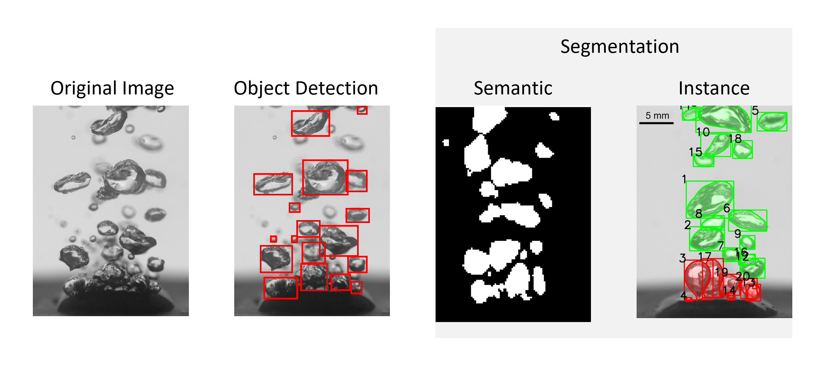

## Assignment 4 - Segmentation and Object Detection:
Within engineering the use of segmentation and object detection have many applications. For example, segmentation can be used to obtain the approximate vapor fraction from boiling images. This assignment will have you using a couple popular semantic segmentation and object detection models.
For semantic segmentation, you will use boiling images and corresponding masks made using labelme and a popular model UNET (which is provided here so you can just copy and put directly into your code): 


```python
def unet_model(input_size=(128, 128, 3)):
    inputs = layers.Input(input_size)
    
    # Contracting path (Encoder)
    c1 = layers.Conv2D(64, (3, 3), activation='relu', padding='same')(inputs)
    c1 = layers.Conv2D(64, (3, 3), activation='relu', padding='same')(c1)
    p1 = layers.MaxPooling2D((2, 2))(c1)
    
    c2 = layers.Conv2D(128, (3, 3), activation='relu', padding='same')(p1)
    c2 = layers.Conv2D(128, (3, 3), activation='relu', padding='same')(c2)
    p2 = layers.MaxPooling2D((2, 2))(c2)
    
    c3 = layers.Conv2D(256, (3, 3), activation='relu', padding='same')(p2)
    c3 = layers.Conv2D(256, (3, 3), activation='relu', padding='same')(c3)
    p3 = layers.MaxPooling2D((2, 2))(c3)
    
    # Bottleneck
    c4 = layers.Conv2D(512, (3, 3), activation='relu', padding='same')(p3)
    c4 = layers.Conv2D(512, (3, 3), activation='relu', padding='same')(c4)
    
    # Expansive path (Decoder)
    u5 = layers.UpSampling2D((2, 2))(c4)
    u5 = layers.Concatenate()([u5, c3])
    c5 = layers.Conv2D(256, (3, 3), activation='relu', padding='same')(u5)
    c5 = layers.Conv2D(256, (3, 3), activation='relu', padding='same')(c5)
    
    u6 = layers.UpSampling2D((2, 2))(c5)
    u6 = layers.Concatenate()([u6, c2])
    c6 = layers.Conv2D(128, (3, 3), activation='relu', padding='same')(u6)
    c6 = layers.Conv2D(128, (3, 3), activation='relu', padding='same')(c6)
    
    u7 = layers.UpSampling2D((2, 2))(c6)
    u7 = layers.Concatenate()([u7, c1])
    c7 = layers.Conv2D(64, (3, 3), activation='relu', padding='same')(u7)
    c7 = layers.Conv2D(64, (3, 3), activation='relu', padding='same')(c7)
    
    # Output layer
    outputs = layers.Conv2D(1, (1, 1), activation='sigmoid')(c7)  # Binary output for binary segmentation
    
    model = models.Model(inputs, outputs)
    
    return model
```

For object detection, you will be using a dataset of your choice from [here](https://public.roboflow.com/object-detection) and the model yolov8 from ultralytics. 

**Tutorial**:<br> [](https://colab.research.google.com/drive/1Rrw1nVSojROv_trXraC6x9hQABRAiduE?usp=sharing) 

---
#### INTRODUCTION
Object detection and segmentation are two computer vision tasks. Object detection is the task of identifying and locating specific objects within an image. These models typically return bounding boxes that capture the region of interest. Segmentation, on the other hand gives a full mask of the object, it specifies which class each pixel belongs too. It is the process of partitioning the image into meaningfull parts. These models are used for computer vision processes so that machines can understand where and what objects are. They are used for autonomous vehicles, medical imaging analysis, agriculture applications, robotics, etc. 

 

#### OBJECT DETECTION
Object detection is used to locate and identify objects within an image. This model will take in an image and output a bounding box with class prediction. 

The dataset used is important. You will need a dataset with images and corresponding labels. For this you can either find one online or generate your own training set. Roboflow provides some free public sets. If you want to genrate your own set you can use some sort of labeling software such as labelme. For this you will draw boxes and label objects within your images. 

**Transfer learning** is an important and useful skill. It can save you a lot of time, energy, and improve your model performance. Transfer learning is where you use an already trained model for a different but similar application than yours. Instead of using randomly assigned weights to start your model, you can use one that has already be defined. This will help your model train faster and can allow for higher accuracy with less training data. 

One popular model is the yolo model. There are several yolo models and actually not all of them are soley object detection models. They have classification and segmentation models too. Visit this site to see a list of all mdoels. To use them you will need to install Ultralytics. For this assignment, you will use the yolov8 object detection model. There are also different versions of this model. For the tutorial I am using the nano one because it is smaller and will take less time to train. You can try the larger ones for higher accuracy but it will take more time for training. Since these are predifined models, they have their own way that input data is handled. You will need to make sure you prepare your data in the correct way. They provide good documentation for this.


#### SEGMENTATION
There are two types of segmentation tasks in machine learning; semantic and instance. Semantic segmentation is where each pixel is classified as belonging to a specific class. For this type of model, all objects of the same type are treated the same. So this means if there are two objects within an image semantic segmentation will not distinguish between them. Instance segmentation is similar to semantic except it will distinguish between objects belonging to the same class. This means it will identify seperate objects within an image. 

Since this homework will use semantic segmentation, we will focus on it. This model is actually very similar to our classification model except instead of classifiying an entire image as belonging to a category, we will classify every pixel. There are so many applictions of this type of model but we will focus on one dummy example. Say we want to develop a model to automatically identify and locate issues in manufactured parts. A model like this might have applications within quality control for a company. So we have our goal. We want to generate masks to determine where specific issues occur on parts.

The first thing we will need to do is get our dataset. One possibilty is to find a relevant dataset online that already has the masks someone else generated. This may not always be an option so you may have to prepare your own dataset. To do this you will need to outline the images. Labelme is a great software for generating labeled masks. With this you can trace the objects and assign labels to them. 

Now that we have our dataset we will define our architecture. This model will take in an image input and output class probablities for each pixel of that input image. SIMPLE EXAMPLE MODEL

This simple model probably wont work well so you will probably need a more advance architecture. One popular architecture for semantic segmentation is UNET. It was developed by NAME for PURPOSE. This is the model we will use for the homework. I really want to emphasize how segmenatation is just more complex classification. 

From this model, you will see a lot of similarities to the more simple classification model we did previously. For example, the activation function on the last layer and the loss function. 

#### FURTHER WORK
Segmentation and object detection can both be used for tracking objects within videos. For the simplist case (only one object in the video), if you just identify the location of an object in each frame in the image via your trained model you can determine its movements. For more complex cases you will need some kind of tracking model to determine if the object in one frame is the same in the next. Check out SORT or OCSORT. 
