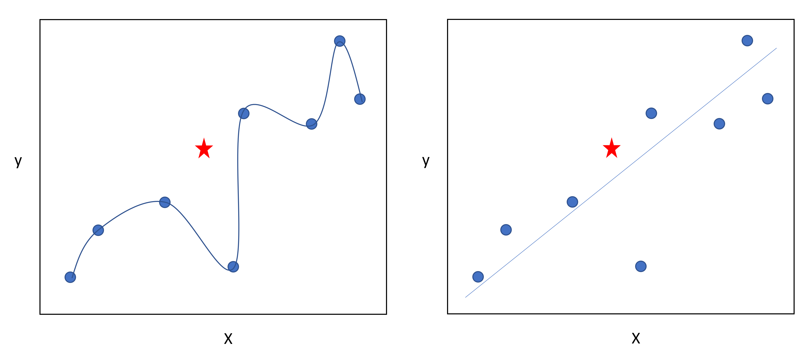

### Assignment 1 - Regression:
In pool boiling experiments, the boiling heat flux can be estimated as the supplied power divided by the heater surface. However, this estimation will not be very accurate due to heat loss and other non-ideal conditions in experiments, especially for thin-film heaters with relatively low thermal conductivities (e.g., ITO heaters). Conventionally, finite-element simulations are used to evaluate the heat loss to validate or correct the experimental assumptions. Machine learning provides another perspective for tackling this issue. The heat loss and other non-ideal conditions can be captured and accounted for by the hidden layers of neural networks. The target of Problem 1-1 is to develop an MLP model to predict heat flux using temperature. The data set includes the temperature and the heat flux during a transient pool boiling test. a. Set up and train an MLP and a GPR model to predict the heat flux based on the temperature. Report the training curves (training/validation accuracy/loss vs. epoch) and the training time (time/epoch, time till the best model). b. Circumvent the effects of overfitting using k-fold cross-validation (e.g., using 100 foldings). <br><br>

**Tutorial**:<br> [](https://colab.research.google.com/drive/100jLm4_UesIVNyjq-mCEIVxE28kXYqX6?usp=sharing) 


---
#### INTRODUCTION
Regression is a supervised learning method that is used to predict continuous values. The following will explain some key concepts. We will start with a simple dataset. Our goal is to develop a model to predict y from x so we can approximate the value x=2.5.

Table 1: Dataset
|x|y|
|---|---|
|0|0|
|1|2|
|2|4|
|3|6|
|4|8|

Now, we don’t know the value of y for x=2.5. So it is important to determine if our model is good so we can trust our predictions. We can make an infinite number of models that can fit the data but they probably won’t all be good representations of it. That is why testing data is so important. We will want to withhold a random subset of our dataset from training so that we can run the model on it to understand how it did. In this case our testing set is chosen as:

Table 2: Testing Data

|x|y|
|--|--|
|1|2|
|4|8|

#### LINEAR REGRESSION

We will start with the simplest of these regression methods, linear regression. You have probably used this previously (for best fit in excel) so for comparison lets go over the process behind it. The equation of a line is $y=mx+b$ where m and b are the slope and y-intercept respectively. The goal of linear regression is to find a line that minimizes the distance of the data points to said line. The equations for the ordinary least squares regression are:

$$ m = \frac{\sum (x- \bar{x})(y-\bar{y})}{\sum (x-\bar{x})^2} $$ 

$$ b = \bar{y} - m * \bar{x} $$

Where $\bar{x}$ and $\bar{y}$ are the averages of the x's and y's. <br><br>
We then plug in our training values in to these formulas to solve for the slope and y-intercept and get m=2 and b=0. <br><br>

Now we check our testing data:

|x|y|$y_{pred}$|
|--|--|--|
|1|2|2|
|4|8|8|

We see that it predicts the correct values for the testing data so we are satisfied with its ability to predict outside of the training.

Lastly we predict our value.
$2*(2.5)+0=5$
<br><br>This can be also implemented in python used the sklearn library:

```python
from sklearn.linear_model import LinearRegression
import numpy as np

# Define our dataset
X_train=np.array([0,2,3]).reshape(-1,1)
Y_train=np.array([0,4,6])
X_test=np.array([1,4]).reshape(-1,1)
Y_test=np.array([1,8])

# Train Model
model=LinearRegression()
model.fit(X_train, Y_train)
print("m: ", model.coef_[0])
print("b: ", model.intercept_)

# Test model 
y_test_pred=model.predict(X_test)
print("Testing Data y preditions:", y_test_pred)

# Make final prediction:
print("x=2.5, y=", model.predict(np.array([2.5]).reshape(-1,1)))
```

#### NEURAL NETWORKS
The least squares linear regression method worked great for this simple dataset but with more complex non-linear datasets more complex models are needed to fully describe the translation from x to y. Deep learning methods describe models with multiple layers to extract features. The simplest of these is the multilayer perceptron. This model is inspired by the neurons in the human brain. The network is composed of multiple layers of neurons. Where one neuron, shown in figure NUMBER, describes a mathematical function. Specifically:

$$ y=\sigma \left( \sum W_ix_i+b \right)$$

Where $x_i$ are the inputs to the neuron, $W_i$ are the weights, b is a bias and sigma is an activation function. More on what all these mean later. To construct a mlp, you just specify neurons and layers. The activation functions can be used to add nonlinearity to the model or to specify the output type. For regression, the activation function of the last layer will be linear. This activation function is defined as (f(x)=x) or in other words the input remains unchanged. <br><br>
Say we have the simplest neural network we could create. It has one input, one neuron, one layer and the linear activation function.  The equation of the neuron will be y=Wx+b. <br><br>
Now we want to fit this model to our dataset so we can predict x=2.5. To do this we first randomly initialize all model weights and biases: Y=5*x+2 <br><br>
We then need to define a **loss function**. Our goal will be to minimize the loss function. We ideally want the loss to be zero implying that the prediction is the same as the label. For regression we will use mean squared error but there are several others that are commonly used such as mean absolute error.

$$ MSE= \frac{1}{n} \sum ^n_{i=1} \left( Y_i - Y_{pred,i} \right) ^2 $$

Where n is the number of data points, $Y_i$ is the true y and $Y_{pred,i}$ is the predicted value. <br><br>
So what we will do for training is pass our x inputs through our model to get predicted y values. 

|x|y|$y_{pred}$|
|--|--|--|
|0|0|2|
|2|4|12|
|3|6|17|

As you can see our predicted values are awful. This is okay because this is just a random guess. So now we will use these values to calculate our loss: MSE=63 <br><br>
Now we can use this loss value to update our weights and biases using an **optimizer** and **backpropagation** (which will be explained elsewhere). The most basic optimizer is *gradient descent* and the corresponding equations for updating the trainable parameters are shown below: 

$$ W_x = W_x^* - \alpha \left( \frac{dLoss}{dW_x} \right) $$

$$ b_x = b_x^* - \alpha \left( \frac{dLoss}{db_x} \right) $$

Where $W_x$ and $b_x$ are the new weights and biases, $W_x^\*$ and $b_x^\*$ are the old weights and biases, and $\alpha$ is the learning rate. We will then take the derivative of the loss with respect to each weight and bias.

$$ \frac{dMSE}{dW} = \frac{1}{n} \sum_{i=1}^n 2 \left( Y_i - Y_{pred,i} \right) \left(-\frac{dY}{dW} \right) $$

$$ \frac{dMSE}{db} = \frac{1}{n} \sum_{i=1}^n 2 \left( Y_i - Y_{pred,i} \right) \left(-\frac{dY}{db} \right) $$

Where $\frac{dY}{dW} = x, \frac{dY}{db}=1$. <br><br>

Then we plug in all our values to solve for the derivatives of the loss function with respect to each learnable parameter. 

$$ \frac{dMSE}{dW}=32.67, \frac{dMSE}{db}=14 $$

Lets assume we are using a learning rate of 0.1. We can update our parameters as:

$$ W_{new}=1.733, b_{new}=0.6 $$


Now we have completed one full pass of the data. This is called an epoch. We will then continue our training process like this to better fit our model. We will continue until our training conditions are met. This could be many things such as: train for a set number of epochs, train until the loss is under a certain value, use validation data (more on this later) and train until it is under a certain loss, or you can set other more complicated stopping criteria. <br><br>

For this simple example, we will just specify the amount of epochs to complete. Note, we could get more accurate models by specifying the loss threshold and continuing training. Here we completed 10 epochs:

|Epoch|W|b|MSE|
|---|--|--|--|
|Initialize|5|2|63|
|1|1.733|0.6|0.13482|
|2|1.765|0.569|0.11735|
|3|1.779|0.5335|0.1032|

Figure NUMBER shows the training curve for the 10 epochs. The loss is decreasing over the training epochs which is what we want to see.<br><br>
We now will test our model with the withheld set. This will show if we trust our model to make predictions on data not used within the training. <br><br>
With our new W=1.859 and b=0.341 we will make predictions:

|x|y|$y_{pred}$|
|--|--|--|
|1|2|2.2|
|4|8|7.777|

Our testing MSE is 0.0449. This is similar to our training MSE loss. Whether or not this is acceptable is based on your own situation. For the case of this demo, we are going to say this error is fine. 
Finally, we can predict our y value for input x=2.5 using our model. We get 4.987. 

This same process can be done in python using Tensorflow: <br><br>

```python
import tensorflow as tf
import numpy as np

# Define our dataset
X_train=np.array([0,2,3]).reshape(-1,1)
Y_train=np.array([0,4,6])
X_test=np.array([1,4]).reshape(-1,1)
Y_test=np.array([1,8])

# Define our simple model
model=tf.keras.Sequential([
      tf.keras.layers.Dense(1,activation='linear', input_shape=(1,))
])

# Define our optimizer
model.compile(optimizer=tf.keras.optimizers.SGD(learning_rate=0.1), loss='mse')

# Train our model
model.fit(X_train,Y_train, epochs=10, batch_size=3, verbose=1)

# Test our model
print("Testing predictions:", model.predict(X_test))

# Make our prediction
print("At x=2.5, y=", model.predict(np.array([2.5]).reshape(-1,1)))
```
Note this may not be the same as what I walked through because of the random initialization. <br><br>
You may be asking “ this has been with a very simple network but what happens if we have more complicated networks?”
This is a great question. The process of upscaling is pretty simple now that we have this understanding. We will now get into backpropagation. Which is the process of updating the weights. It is composed of the following steps. These should look familiar to you since we just did a very simple example of them previously:

1.	Forward pass: make predictions
2.	Calculate loss 
3.	Backward pass: calculate partial derivatives of loss function via chain rule
4.	Optimizer: update model weights
   
These processes will still be performed for a larger network. By using chain rule for step 3 and 4 the gradients for each weight and bias can be efficiently solved for. For example consider the network in figure NUMBER. Each nueron has a function associated with it. So what we will want to do is calculate the partial deveriviates for each neuron.

$$ y=\sigma \left( \sum W_ix_i+b \right)$$

Let's define $z= \sum W_ix_i +b$
So then the derivative of y with respect to $W_i$ and b would be:

$$\frac{dy}{dW_i}=\sigma'(z)*\frac{dz}{dW_i}=\sigma'(z)(x)$$

$$\frac{dy}{db}=\sigma'(z)*\frac{dz}{db}=\sigma'(z)*1$$

Now we will want to go calculate the derivative of the loss with respect to each trainable parameter. But what you can see is something kind of cool happens. So say we want to solve for $\frac{dMSE}{dW_{11}}$:

$$ \frac{dMSE}{dW_{11}}=2(Y-Y_{pred})\frac{dY_{pred}}{dW_{11}}=2(Y-Y_{pred})\frac{dY_{pred}}{da_1}\frac{da_1}{dW_{11}}$$

We see that we have already solved for $\frac{da_1}{dW_{11}}$. So similarly we can use this to solve for all weights and bias gradients so we dont have to duplicate computations.

#### OPTIMIZERS
The optimizer is how we update the learnable parameters. The most basic of these is *Gradient descent* as shown previously. It uses all the data to the update the weights and biases. Although this leads to accurate and more stable updates the process requires high computation. Another method *Stochastic gradient descent* was proposed to fix this. It uses the same update equation but instead of using the entire dataset for updating, it uses a single point or smaller batches to update the gradients. This allows for faster training process but can lead to oscillations around the minimum. Another optimizer you commonly see is the Adam optimizer. This method combines two extensions of SGD (i.e., AdaGrad and RMSProp). It allows for training speed ups and helps prevent oscillations through the use of momentum. <br><br>

#### OVERFITTING

There are several things you have to look out for when training models. One important issue you need to avoid is overfitting. This can make it look like your training is going well but when checking on your testing data it has horrible performance. Overfitting is especially a danger with noisy data, you want to make sure your model describes trends rather than specific noise. For example, figure NUMBER shows two functions that describe the same set of data. The blue are the values the model was trained on and the star shows a testing data point. You can see the right function yeilds a closer prediction to the testing data. <br><br>



There are some ways to help prevent this problem. One important factor is amount of data. It is important to have a large dataset that covers several variations you might see in a deployed model. Also the use of validation data during training can help in stopping the training process before over fitting occurs. Additionally, the use of cross fold validation can also improve the training. Also shuffling the data can help avoid overfitting. 

#### VALIDATION DATA
Another important concept is validation data. I briefly mentioned it previously but said nothing beyond that. The inclusion of validation data is used for mitigating overfitting. This process works by setting aside a subset of training data. This data will be used at the end of an epoch to check in and see how well the training is going. The goal will be to minimize the loss of the validation data rather than the loss of the training data. 

#### GAUSSIAN PROCESS REGRESSION (GPR)
Gaussian process regression is a probabilistic, kernel-based method. The nice thing about GPR is you not only get the point prediction you also obtain the confidence of that prediction. We will want to find a function that translates x to y. There are multiple that will fit our data. Gaussian Process Regression assumes these function values follow a multivariate normal distribution.  

$f(x) \sim Normal( \mu, \Sigma)$

GPR is based on the posterior distribution:

$$P(f|X)= N (f| \mu, K)$$

Where P(f|X) is the distribution of function values given inputs X, $X=[x_1,..., x_n]$ are the the data points f are functions values, $\mu$ mean function and K is kernel function. Mean defaults to zero. Guassian model is a distribution over possible functions where shapes are defined by K that fit a set of points. <br>

This normal distribution is fully defined by a mean and covariance function. We typically assume $\mu=0$ and we use kernels for approximating the covariance matrix $\Sigma$. 


Let's now walk through the process. First let's choose our kernel function, this function will define the smoothness of our prediction function. There are several to choose from such as the popular radial basis function (RBF) kernel. However, for this simple case we will use the linear kernel function: $k(x_i,x_j)=x_ix_j$. We will then define the kernel covariance matrix from our training points and kernel function:

$$K=\begin{bmatrix}
k(x_1,x_1) & k(x_1,x_2) & k(x_1,x_3) \\
k(x_2,x_1) & k(x_2,x_2) & k(x_2,x_3) \\
k(x_3,x_1) & k(x_3,x_2) & k(x_3,x_3)
\end{bmatrix} = \begin{bmatrix}
0 & 0 & 0 \\
0 & 4 & 6 \\
0 & 6 & 9 \end{bmatrix} $$

We will eventually take the inverse of this matrix so the 0 in the diagonal will present an issue. To account for this we will add a small value to the diagonals $K+\alpha I$. We will use $\alpha=1e-6$. 
Now whe want to make predictions for our test data so we will calculate our covariance matrix for the testing data.


So we want to predict the value of y given x and the training data so we can define the posterior distribution:

$$p(f_* |x_* ,X,Y) \sim N(\mu_* , \sigma ^2_* )$$

Where 

$$x_* = \begin{bmatrix}
1 \\
4 \end{bmatrix}$$

$$ X = \begin{bmatrix}
0 \\
2 \\
3 \end{bmatrix}$$

$$Y=\begin{bmatrix}
0 \\
4 \\
6 \end{bmatrix}$$


We will also need to computer the kenrnel between the testing and training points:

$$ k_* = \begin{bmatrix} 
k(x _{* ,1} , x_1) & k(x _{* ,2} , x_1) \\ 
k(x _{* ,1} , x_2) & k(x _{* ,2} , x_2) \\
k(x _ {* ,1} , x _3) & k(x _{* ,2} , x_3) 
\end{bmatrix} = \begin{bmatrix}
0 & 0\\ 
2 & 8\\ 
3 & 12\end{bmatrix} $$

Our prediction will be the mean of the postier distribution:

$$\mu_* = k_*^T K^{-1} Y$$

We can plug in our values and solve:

$$ \mu _* = \begin{bmatrix}
0 & 2 & 3 \\
0 & 8 &12 
\end{bmatrix} \begin{bmatrix}
0.000001 & 0 & 0 \\
0 & 4.000001 & 6 \\
0 & 6 & 9.000001 \end{bmatrix} ^{-1} \begin{bmatrix}
0 \\
4 \\ 
6 \end{bmatrix} = \begin{bmatrix}
2.000 \\
8.000 \end{bmatrix}$$

We can also compute the variance at the test points which will tell us the uncertainty of the prediction:

First we will need to compute the covariance matrix of the test points:

$$k=\begin{bmatrix}
k(x _{* ,1}, x _{* ,1}) & k(x _{* ,1}, x _{* ,2} ) \\
k(x _{* ,2}, x _{* ,1} )& k(x _{* ,2}, x _{* ,2} ) \end{bmatrix}
= \begin{bmatrix} 
1 & 4\\
4& 16 \end{bmatrix}$$

Now we can plug all our numbers into the equation for the variance:

$$
\sigma _* ^2 = k(x _* , x _* ) - k _* ^T K^{-1} k _* = \begin{bmatrix}
1 & 4 \\
4 & 16 \end{bmatrix} -  \begin{bmatrix}
0 & 2 & 3 \\
0 & 8 &12 
\end{bmatrix}  \begin{bmatrix}
0.000001 & 0 & 0 \\
0 & 4.000001 & 6 \\
0 & 6 & 9.000001 \end{bmatrix} ^{-1} 
\begin{bmatrix}
0 & 0\\ 
2 & 8\\ 
3 & 12\end{bmatrix} =
\begin{bmatrix}
0 & 0 \\
0 & 0 \end{bmatrix}
$$

The diagonal variances correspond with each data point. Then the standard deviation for each point will be $\sigma_* = \sqrt{\sigma^2 _*}$. So in this simple example on the test case the uncertainty is 0. <br><br>

Now we will take $x=2.5$ and predict the value of y and the uncertainty of the prediction exactly how we just did on the testing data we get $y=5.000$ and $\sigma =0$. 

