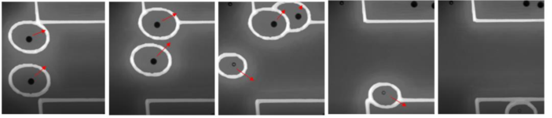

**Credits:** This project was completed by [Larry Marshall](https://www.linkedin.com/in/larrycmjr) when taking the machine learning for mechanical engineers class in Fall 2022. This folder includes the source code and report for the project. This work is published on the 2023 ASME IDETC-CIE 2023, paper id: (DETC2023-116470](https://asmedigitalcollection.asme.org/IDETC-CIE/proceedings/IDETC-CIE2023/87295/V002T02A075/1170350).

**Abstract:** Optically Induced Dielectrophoresis (ODEP) is used to manipulate micro and nano scale particles within a suspension. To manipulate the particles in an ODEP system, light needs to be focused onto the surface of an ODEP chip where a photoconductive thin film becomes more conductive, resulting in an electric field gradient. Particles susceptible to the DEP force respond with either an attraction or repulsion to the induced electric field gradient. The behavior allows for the patterning of light onto the substrate surface to manipulate the particles in a predictable manner. ODEP has the potential to be used for single cell analysis of bacterial or cancerous cells in automated systems, however when ODEP is used to separate two particles which respond the same to the electric field gradient. To accomplish sorting of two particles which respond the same, I have integrated an existing ODEP systems custom written software to receive the location and class of detected objects within the ODEP chip. The software then generates light patterns and moves the particle from its current position to a predesignated location based on the class. A cascade Haar-basis feature classifier was created for each class and implemented into a python script.

  

