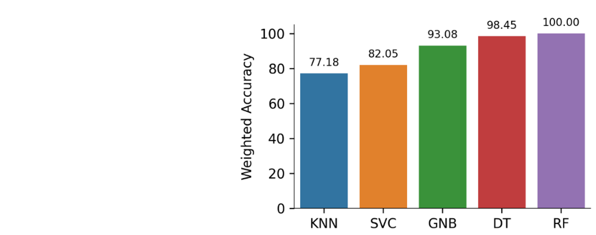

**Credits:** This project was completed by [Larry Marshall](https://www.linkedin.com/in/larrycmjr) when taking the machine learning for mechanical engineers class in Fall 2022. This folder includes the source code and report for the project. This work is published on the 2023 ASME IDETC-CIE 2023, paper id: (DETC2023-116470](https://asmedigitalcollection.asme.org/IDETC-CIE/proceedings/IDETC-CIE2023/87295/V002T02A075/1170350).

**Citation:** Marshall Jr, L., Jensen, D., & Hu, H. (2023). Supporting Condition-Based Maintenance for Rotary Systems Under Multiple Fault Scenarios. Proceedings of the ASME 2023 International Design Engineering Technical Conferences & Computers and Information in Engineering (IDETC/CIE) Conference, V002T02A075.
 
**Abstract:** This paper aims to conduct an evaluation of a range of supervised learning algorithms, which are utilized for the purpose of classifying single and multi-fault scenarios associated with rotary systems. Furthermore, the paper aims to develop a proof-of-concept prototype for in-situ fault detection and classification. The contemporary industry has been moving away from scheduled-based maintenance to condition-based maintenance, primarily due to the enhanced cost savings and flexibility offered by the latter. However, to achieve condition-based maintenance, it is crucial for operators to have access to fast and accurate methods of component fault detection and classification. Presently, various techniques are employed by companies for classifying machinery faults, which primarily involve a binary classification problem that focuses on the determination of whether a particular component is healthy or not. While this approach is useful, it often results in a loss of valuable information such as knowledge pertaining to the degraded component, the extent and location of degradation, and other critical details that can help companies make more informed decisions. By having access to more information, companies can become more fault-adaptive and can modify their processes and sequences to maintain product throughput. In order to achieve this, fault classification must occur at the system level, rather than solely through specific component monitoring. In the rotary machine domain, researchers primarily concentrate on the classification of single ball-bearing faults. However, little research has been conducted on the classification of multiple faulted bearings, warped shafts, or combinations of these scenarios, all of which are major and very plausible fault scenarios. This paper attempts to address these gaps by proposing a low-cost method for in-situ multi-fault classification. The approach aims to provide an effective solution for enhanced condition-based maintenance and improved decision-making in the rotary machine domain..

  

