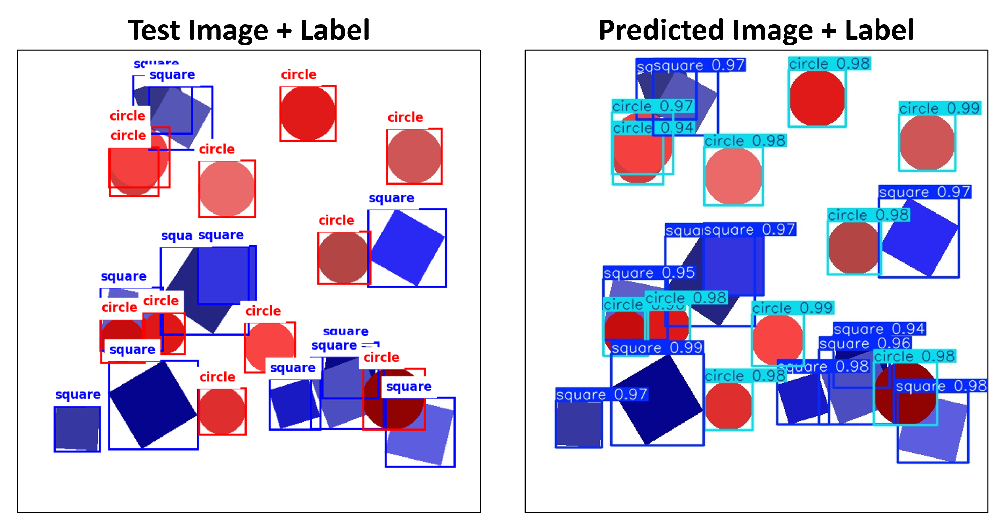

**Credits:** This project was completed by [Kaushik Ramini]([https://www.linkedin.com/in/jeremy-meyer-009b62176/](https://www.linkedin.com/in/kaushik-ramini/)) when taking the machine learning for mechanical engineers class in Fall 2024. This folder includes the source code and report for the project. 

**Abstract:** The current state of robotics education in the United States is analogous to where computer science education was 10-15 years ago. There is a large push to implement advanced robotics courses into the high school curriculum. To encourage adoption, there are state and federal funding programs created exclusively for robotics or CTE (Career Technical Education) implementations. This market is where my company, Sphero, operates. Sphero develops CTE solutions for k-12 schools, comprised of a product (physical robot, building system, or sensor), digital platform (control/programming environments), and curriculum (teacher and student lesson plans). The most recent platform launch was Sphero Blueprint, a modular mechanical building system – like Lego but tailored for the classroom. The immediate goal of this project is to develop a machine learning model that can identify and quantify the number of unique objects in an image, as well as providing the location for each of these objects. The scope of this project is limited to basic 2D shapes (square and circle) on a white background, but the images will become increasingly complex (number of shapes, size variation, overlap, etc.). This will allow the model to first be verified against a best-case-scenario dataset, and then evaluated as the images become more representative of real-life scenarios.

  

