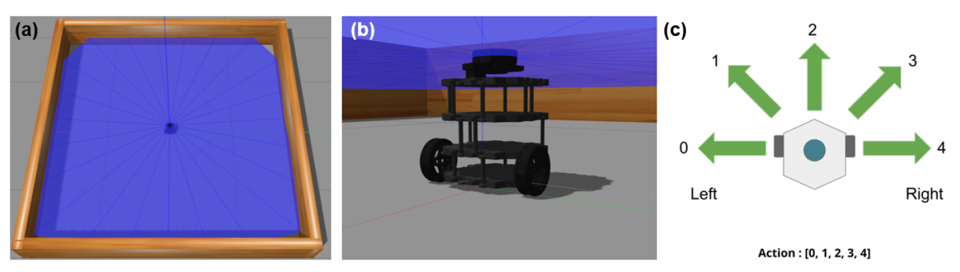

**Credits:** This project was completed by [Mishek Musa](https://www.linkedin.com/in/mishekmusa/) when taking the machine learning for mechanical engineers class in Fall 2021.This folder includes the source code, report, and videos for early runs and end runs of this project. 

**Abstract:** This project a reinforcement learning approach, DQN, was used to train a robot for navigation in an unknown environment by using data available from sensors on the robot (LiDAR, encoders, etc.). Currently a robot prototype does not exist, however a simulated robot and environment was created using the open-source physics engine Gazebo in ROS. The robot was trained for 110 episodes and it can be seen that the robot is able to navigate through the environment and reach its goals while avoiding collisions with the boundaries. This work lays a good foundation for the further development of the system to be used for real-time mobile robot navigation.

  

